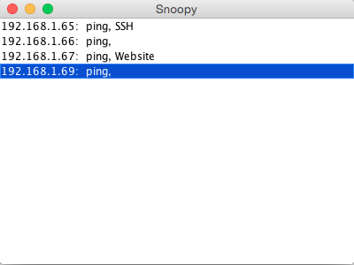

Snoopy
======
Snoopy is simple service detection program. Snoopy isn't your grandma's port scanner. Snoopy scans for common services, the goal being to implement a large fraction of [common ports](http://en.wikipedia.org/wiki/List_of_TCP_and_UDP_port_numbers).

### What's the point?
The main advantage of Snoopy is ease of use. There is no need to try and find what services are running, Snoopy does that for you. Another distinct advantage is the ability to scan for UDP based services. Snoopy does this by using the appropriate UDP protocol and asserting whether the remote supports it.

